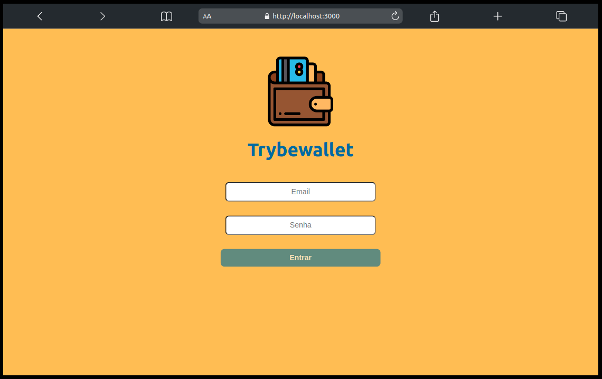
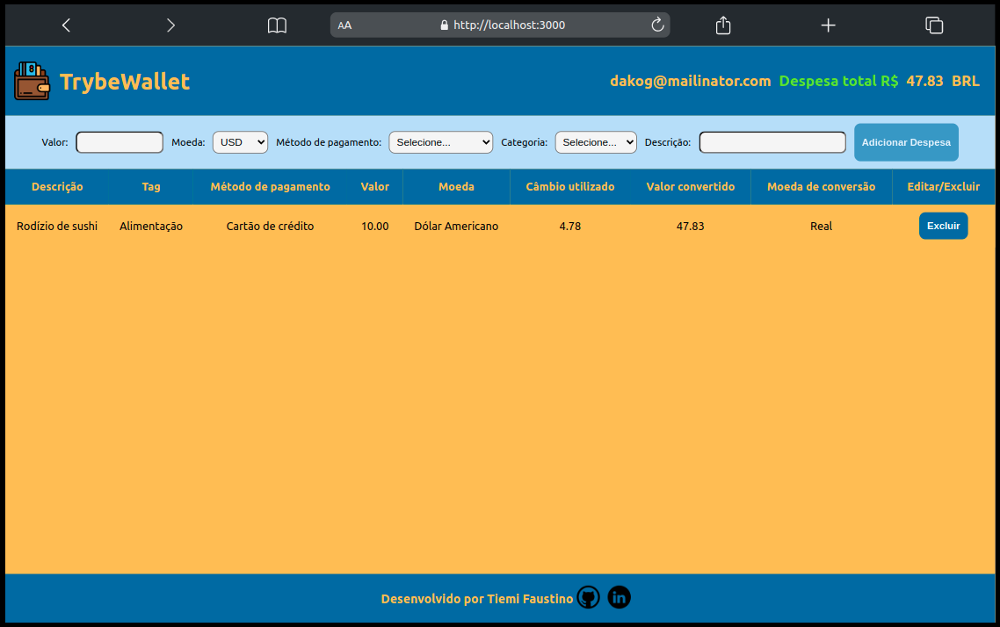

# 💰 Trybe Wallet

Projeto realizado durante o módulo de Front-end no curso de Desenvolvimento Web pela [Trybe](https://www.betrybe.com/), criando um store, reducers, actions, actions assíncronas e dispatchers no Redux conectando aos componentes em uma aplicação React. 

A aplicação é uma carteira de controle de gastos com conversor de moedas utilizando a [awesomeapi API de Cotações](https://economia.awesomeapi.com.br/json/all) onde é possível:
- Adicionar e remover um gasto;
- Visualizar uma tabelas com seus gastos;
- Visualizar o total de gastos convertidos para Real Brasileiro.


## ✨ Tecnologias Usadas

- 

- 

- 

- 


## 🎉 Application


## 📹 Demo




## 💻 Instalando Dependências

Clone o projeto

```bash
  git clone git@github.com:tiemifaustino/trivia-group24.git
```

Entre na pasta que você acabou de clonar

```bash
  cd trivia-group24
```

Instale as dependências

```bash
  npm install
```

Inicialize o projeto

```bash
  npm run start
```
